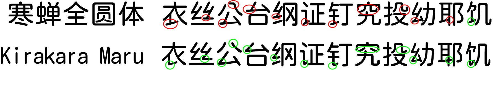

# kirakara-round

本字体以 [寒蝉全圆体](https://github.com/Warren2060/ChillRound) 为目标字体，以 [思源黑体CN](https://github.com/adobe-fonts/source-han-sans) 为结构参考字体，人工挑选符合大陆规范的 4991 字后使用 [zi2zi-JiT](https://github.com/kaonashi-tyc/zi2zi-JiT) 训练，生成1661规范字。支持 GB2312 字符集。

注意事项：
1. 程序生成出来的是 png 图片，矢量化后字体会有边缘不够平滑、点数太多的问题。
2. 其中 110 字由于程序一直生成不出来，是手动使用已生成的部件进行替换调整的。
3. 程序生成的字体会有不协调的问题。
4. 虽然已经人工检查，但可能还是会有部分字有错误（少比划之类的）。
5. 亠部仍然是竖横，这个如果要改掉的话训练用字就就几乎没了，所以没改。
6. 之后可能会使用我自己正在进行开发的 [HanziStyleForge](https://github.com/feiyangjun-1/HanziStyleForge) 测试看看效果如何。
7. 如有发现问题请在 [Issues](https://github.com/feiyangjun-1/kirakara-round/issues) 提出。

本字体使用 OFL 协议，可免费商用、修改等。
